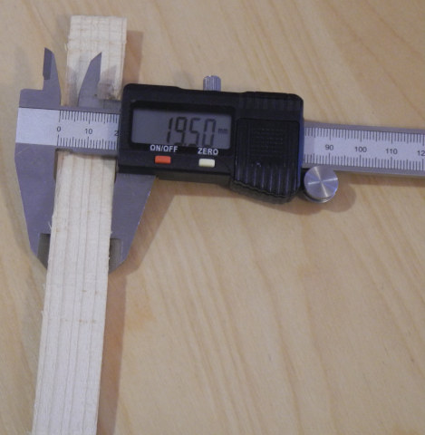
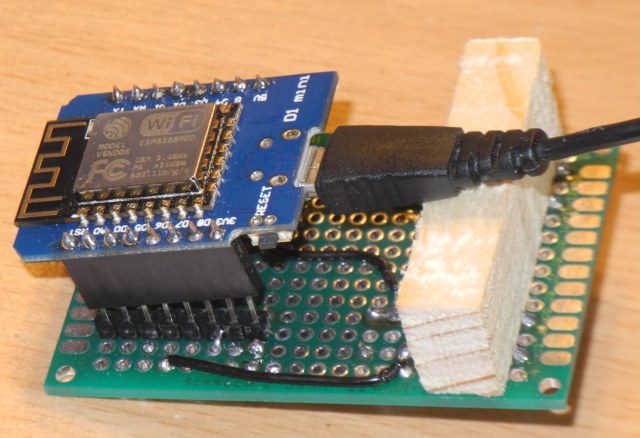
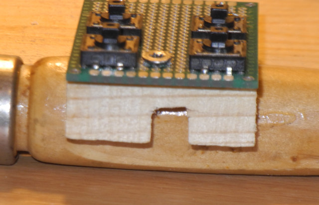
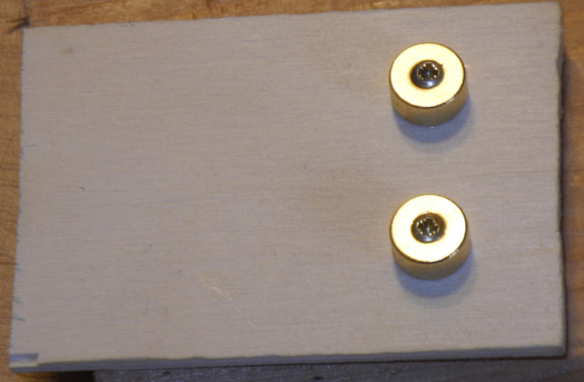

# Radiobuttons

A small project to build a panel with buttons that publish MQTT messages
that can be used to control a radio.

## How to use

Edit [src/wifi.cpp](src/wifi.cpp), adjust the line

`#include "WLAN_     .hh" // not in git`

to include a header file named after your own wireless network, containing

    #undef WLAN_SSID
    #undef WLAN_PASSWORD
    #define WLAN_SSID "The SSID of your own wireless network"
    #define WLAN_PASSWORD "The password of your own wireless network"

Edit [src/mqtt.cpp](src/mqtt.cpp), adjust the line

`#include "MQTT_openhab.hh"`

to include a header file named after your own MQTT server, containing

    #undef MQTT_SERVER_HOST 
    #undef MQTT_SERVER_PORT 
    #undef MQTT_CLIENT_NAME 
    #undef MQTT_USERNAME    
    #undef MQTT_PASSWORD    
    #undef MQTT_DEFAULT_TOPIC
    
    #define MQTT_SERVER_HOST   "Host name or IP address of your MQTT server"
    #define MQTT_SERVER_PORT   1883 // Or another port if you use another
    #define MQTT_CLIENT_NAME   "Unique name for this panel of buttons"
    #define MQTT_USERNAME      "A valid username for your MQTT server"
    #define MQTT_PASSWORD      "The password for that user"
    #define MQTT_DEFAULT_TOPIC "The MQTT topic to publish button presses"

The ESP8266 will publish the messages "turnoff", "louder", "softer", "forward"
when the corresponding buttons are pressed.  The messages and also the digital
input pins to which the buttons are connected can be changed in file
`radiobuttons.hh`. The pins that you choose should support internal pullup
resistors so that you only need buttons connecting the pins to ground and
no other external parts.  Debouncing is done in software.

## Hardware

I have used a Wemos D1 mini, a 20x14 Perfboard, 4 pushbuttons, a USB power
supply and some plywood and scrap would for making a case. See images:

Front side of perfboard.  The two header pins closest to the pushbuttons
(3V and 5V) are not soldered, too close and not needed.

---

Back side of perfboard.  Headers for mounting the D1 mini protrude on the
back side.

---

Headers soldered to D1 mini allow attaching the D1 mini to the headers
on the perfboard.

---

D1 mounted on the perfboard.

---

Thickness of D1 mini mounted with headers.  Need some spacer near the buttons
to create the same thickness there, transfering the force of button pushes
to the back wall of the case.

---

A piece of scrapwood is a bit too thick and needs to be cut.

---

Buttons protrude from perfboard, front cover cannot be nearer to perfboard than
their thickness.

---

Cut mark on scrapwood to create spacer.

---

Spacer attached to perfboard.

---

USB cable (power supply) needs to feed through the spacer.

---

Cut marks on spacer.

---

Cuts done to spacer.

---

Chiseling out the feedthrough.

---

Testing that the power cable fits in the new cut.

---

The mounting screw is now too long.

---

Cut screw.

---

Spacer held by shortened screw.

---

Magnets for detachable wall mounting attachet to back cover.

---

Magnet mounting screws protrude on inside.  Will be screwed into spacer.

---

Apply some glue dots to fix electronic parts on backside cover in addition
to the magnet mounting screws.

---

Mark positions for button holes in front cover.

---

Button hole centers.

---

Diameters of button holes need to be a bit larger than the button diameters.
